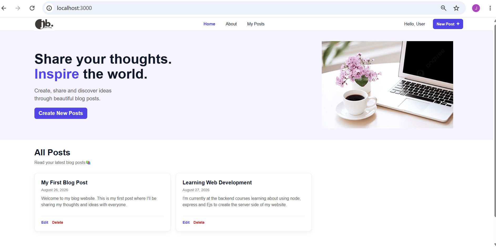
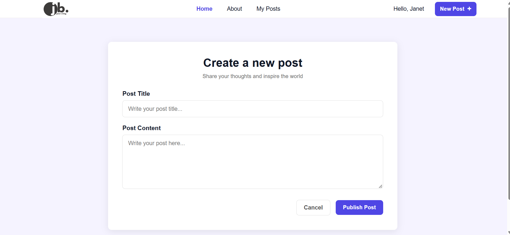

# MyBlog

A simple and responsive blog application built with Node.js, Express.js, EJS, HTML, CSS and JavaScript.

## Features

* Create blog posts
* View all blog posts
* Edit existing posts
* Delete posts with confirmation
* Search through posts
* Display post creation dates
* Responsive design for desktop, tablet and mobile

## Technologies

* HTML5
* CSS3
* JavaScript
* Node.js
* Express.js
* EJS

## Getting Started

### 1. Clone the repository

```bash
git clone https://github.com/Bimbzzyjane/my--blog-page.git
```

### 2. Navigate into the project

```bash
cd Blog Webapp Project
```

### 3. Install dependencies

```bash
npm install
```

### 4. Start the server

```bash
node index.js
```

Then open:

```text
http://localhost:3000
```

## Project Preview

### Homepage



### Create Post



### Mobile View


## Note

Posts are currently stored in memory, so they are reset when the server restarts. A database will be added in a future version.

## Author

**Janet Okedoyin**

